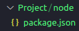
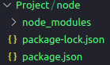
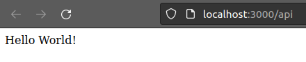
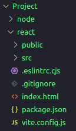
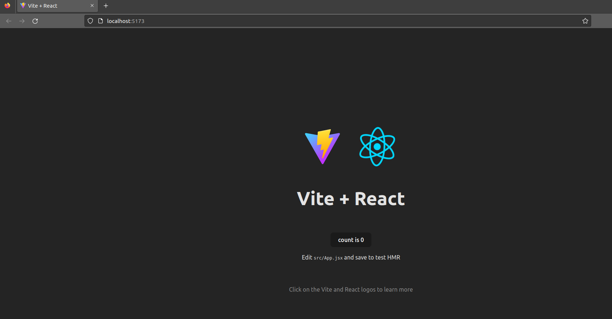
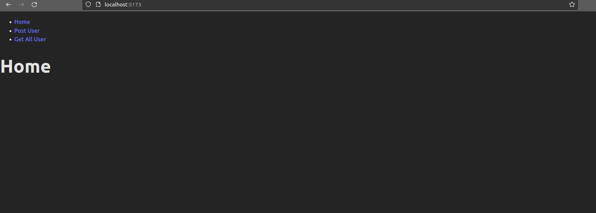
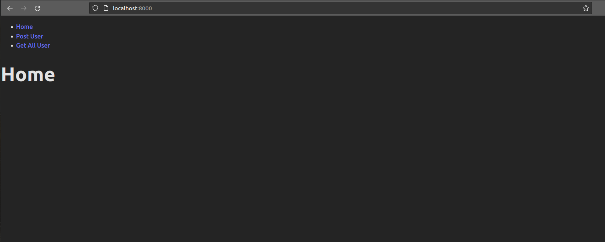
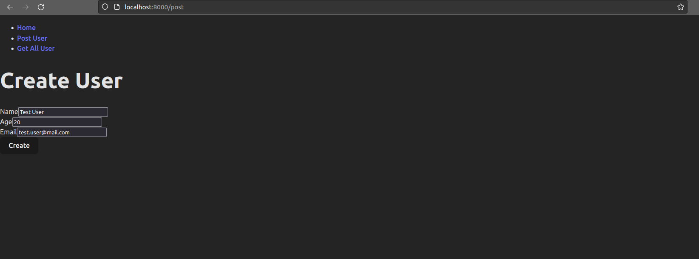
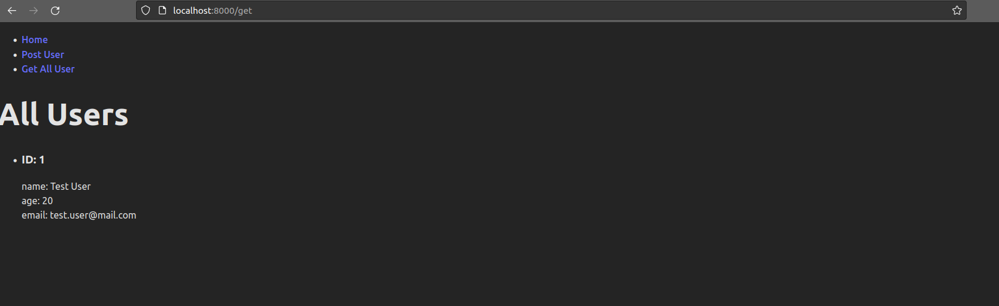
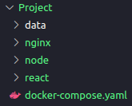

# Dockerize a React application with Node.js, Postgres and Nginx

This tutorial explains how to Dockerize a React application with Node.js, Postgres and Nginx. It provides step-by-step instructions on setting up the back-end, front-end, and Nginx server, along with Dockerfiles and a docker-compose.yml file for containerization.

.png)

## Prerequisites
Ensure that Docker and Node.js are installed on your computer. The version I used for Node was 18.13.0 and for Docker was 20.10.24.

## The Application


## Build the back-end

We will create a simple application that communicates with a database and exposes routes to the front-end.

### Starting the project

Let's start creating a new folder called __Project__. Inside the 
__Project__ folder, create a folder called __node__. Initialize a Node.js 
application inside the __node__ folder using the following command:

```
npm init -y
```

This command will generate a package.json file where we can add project
 dependencies.



### Back-End dependencies:

- __Express__: A Node.js web application framework used to handle client requests to specific endpoints. For more information, refer to the [Express Documentation](https://expressjs.com/en/guide/routing.html).


- __Node-Postgres__: A client for Node.js used to establish a connection with the PostgreSQL database. For more information, refer to the [Node Postgres Documentation](https://node-postgres.com/).

  

- __Nodemon__: A tool that automatically restarts the Node.js application when file changes are detected. For more information, refer to the [Nodemon Documentation](https://www.npmjs.com/package/nodemon).
  
To install these dependencies, navigate to the __node__ folder and run the following command:

```
npm install express pg nodemon 
```

This command will install all the required dependencies. The package manager downloads the packages and their dependencies and stores them in the __node_modules__ folder. This folder contains all the dependencies and their sub-dependencies that our project requires to run.



### Writing the back-end code

Create an __index.js__ file, it will be our main file. Add the following codes inside it.
Start importing the required packages inside the file:

```js
import pg from 'pg';
import express from 'express';
import bodyParser from 'body-parser';
```

Establish a connection with the PostgreSQL database using __node-postgres__:

```js
const { Client } = pg;

const client = new Client({
  user: 'postgres',
  host: 'db',
  database: 'postgres',
  password: '1234',
  port: 5432,
});

client.connect();
```

Create the __users__ table:

```js
const createTable = async () => { 
  await client.query(`CREATE TABLE IF NOT EXISTS users 
  (id serial PRIMARY KEY, name VARCHAR (255) UNIQUE NOT NULL, 
  email VARCHAR (255) UNIQUE NOT NULL, age INT NOT NULL);`)
};

createTable();

```

Use Express and the middleware to parse the POST method:

```js
const app = express();
app.use(express.json());
app.use(express.urlencoded({ extended: true }));
```

Add a Hello World route:

```js
app.get('/api', (req, res) => res.send('Hello World!'));
```

Create a GET method to retrieve all users from the __users__ table:

```js
app.get('/api/all', async (req, res) => {
  try {
    const response = await client.query(`SELECT * FROM users`);
    
    if(response){
      res.status(200).send(response.rows);
    }
    
  } catch (error) {
    res.status(500).send('Error');
    console.log(error);
  } 
});
```

Create a POST method to insert users into the __users__ table:

```js
app.post('/api/form', async (req, res) => {
  try {
    const name  = req.body.name;
    const email = req.body.email;
    const age   = req.body.age;

    const response = await client.query(`INSERT INTO users(name, email, age) VALUES ('${name}', '${email}', ${age});`);

    if(response){
      res.status(200).send(req.body);
    }
  } catch (error) {
    res.status(500).send('Error');
    console.log(error);
  }    
});
```

Finally, add a port that will expose the API when the server is running. Here, we expose it on port 3000.

```js
app.listen(3000, () => console.log(`App running on port 3000.`));
```

There are many other ways of doing and improving the code. We could handle errors better, improve the architecture with controllers, services, repositories and remove secret values from the code. However, as we are not focusing on these aspects, this is going to be our back-end as simple as possible.

### Testing the routes

In the __package.json__ file, inside the __script__ section, add:
```js
"start": "nodemon index.js"
```
 And at the end of file, add:

```js
"type": "module"
```
The __package.json__ file should look like this:
 ```js
{
  "name": "node",
  "version": "1.0.0",
  "description": "",
  "main": "index.js",
  "scripts": {
    "test": "echo \"Error: no test specified\" && exit 1",
    "start": "nodemon index.js"
  },
  "keywords": [],
  "author": "",
  "license": "ISC",
  "dependencies": {
    "express": "^4.18.2",
    "nodemon": "^2.0.22",
    "pg": "^8.11.0"
  },
  "type": "module"
}
```
Now, to start the application, you can run __npm start__ inside the __node__ folder. However, it will crash because we still don't have the database running. So, in order to avoid this error, just comment out the following lines:
 
```js
//client.connect();
...
//createTable();
```
Now run __npm start__ inside the __node__ folder and access the hello world route (http://localhost:3000/api) in the browser to see if it is working. 




 __After testing, uncomment the previous code!!!__
```js
client.connect();
...
createTable();
```


## Build the front-end

Let’s write the front-end logic to process the API endpoints defined above. Inside the __Project__ directory run the following code.
The code will create a new react folder automatically and also a new react project.


```bash
npm create vite react -- --template react
```
I chose Vite tool to create the project. it is a lightweight tool that takes up 31 MB of dependencies, which will save time in starting a new project.tra [Vite Documentation](https://vitejs.dev/guide/).

You will end up with the following structure:



### Front-End dependencies:

- __Axios__: A promise-based HTTP Client for node.js. For more information, refer to the [Axios Documentation](https://axios-http.com/docs/intro).

- __React Router__:  A routing library for React applications. It provides a set of components and utilities that allow you to define and manage the routing functionality in your React application. For more information, refer to the [React Router Documentation](https://reactrouter.com/en/main/start/tutorial).


To install all the dependencies, go inside the __react__ folder and run the following code:

```
npm install axios react-router-dom
```

To run the application, you can execute:
```
npm run dev
```

Accessing the browser at http://localhost:5173, you will get the following page:



### Writing the front-end code

First, let's replace the contents of the App.jsx file with the following code:

```js
import ReactDOM from "react-dom/client";
import { BrowserRouter, Routes, Route } from "react-router-dom";
import Layout from "./components/Layout";
import Home from "./components/Home";
import PostUser from "./components/PostUser";
import GetAllUser from "./components/GetAllUser";

export default function App() {
  return (
    <BrowserRouter>
      <Routes>
        <Route path="/" element={<Layout />}>
        <Route index element={<Home />} />
        <Route path="post" element={<PostUser />} />
        <Route path="get" element={<GetAllUser />} />
        </Route>
      </Routes>
    </BrowserRouter>
  );
}

const root = ReactDOM.createRoot(document.getElementById('root'));
root.render(<App />);
```
The App file manages the routing and renders the specific component at the specific endpoint. For example, at the path="/get" it will return the component GetAllUser, which is responsible for retrieving all the users from our database.

Now let's create the application components. Create a folder named __components__ inside the src folder and create the following four files:
- GetAllUser.jsx
- Home.jsx
- Layout.jsx
- PostUser.jsx

GetAllUser.jsx
```js
import axios from "axios";
import { useEffect, useState } from "react";

const GetAllUser = () => {

  const [users, setAllUser] = useState();

  useEffect(() => {
    axios
      .get("http://localhost:8000/api/all")
      .then((response) => setAllUser(response.data))
      .catch((err) => {
        console.error(err);
      });
  }, []);

    return (
      <>
        <h1>All Users</h1>
        <ul>
        {users && users.map(user => 
          <li key={user.id}>
            <h3>ID: {user.id} </h3>
            name: {user.name} <br></br>
            age: {user.age} <br></br>
            email: {user.email} <br></br>
          </li>
        )}
        </ul>
        
      </>
      );
  };
  
  export default GetAllUser;
```

Home.jsx
```js
const Home = () => {
    return <h1>Home</h1>;
  };
  
  export default Home;
```

Layout.jsx
```js
import { Outlet, Link } from "react-router-dom";

const Layout = () => {
  return (
    <>
      <nav>
        <ul>
          <li>
            <Link to="/">Home</Link>
          </li>
          <li>
            <Link to="/post">Post User</Link>
          </li>
          <li>
            <Link to="/get">Get All User</Link>
          </li>
        </ul>
      </nav>

      <Outlet />
    </>
  )
};

export default Layout;
```

PostUser.jsx
```js
import axios from "axios";
import { useState } from "react";

const PostUser = () => {
  
    const [user, setUser] = useState({
      name: '',
      age: '',
      email: '',
    })

    const createUser = async () => {
      await axios
      .post("http://localhost:8000/api/form", 
      user,
      {
        headers: {
          'Content-Type': 'application/x-www-form-urlencoded'
        }
      })
      .then((response) => {
        setUser({      
          name: '',
          age: '',
          email: '',
        })
        console.log(response)
        return alert("User Created: " + `${JSON.stringify(response.data, null,4)}`);
        })
      .catch((err) => {
        return alert(err);
      });
    }

    const onChangeForm = (e) => {
      if (e.target.name === 'name') {
        setUser({...user, name: e.target.value});
      } else if (e.target.name === 'age') {
        setUser({...user, age: e.target.value});
      } else if (e.target.name === 'email') {
        setUser({...user, email: e.target.value});
      }
  }

    return (
      <div >
          <div>
              <div>
              <h1>Create User</h1>
              <form>
                  <div>
                      <div>
                          <label>Name</label>
                          <input 
                            type="text" 
                            value={user.name}
                            onChange={(e) => onChangeForm(e)} 
                            name="name" 
                            id="name" 
                            placeholder="Name" 
                          />
                      </div>
                      <div>
                          <label>Age</label>
                          <input 
                            type="text" 
                            value={user.age}
                            onChange={(e) => onChangeForm(e)} 
                            name="age" 
                            id="age" 
                            placeholder="Age" 
                          />
                      </div>
                  </div>
                  <div>
                      <div>
                          <label htmlFor="exampleInputEmail1">Email</label>
                          <input 
                            type="text" 
                            value={user.email}
                            onChange={(e) => onChangeForm(e)} 
                            name="email" id="email" 
                            placeholder="Email" 
                          />
                      </div>
                  </div>
                  <button type="button" onClick= {()=>createUser()}>Create</button>
              </form>
              </div>
          </div>
      </div>
      );
  };
  
  export default PostUser;
```
 On the __index.css__ file, the line 29 should be removed:
 ```js 
 place-items: center;
 ``` 
After removing that line, you can run the command `npm run dev` to start the application. Once the application is running, you can access it at http://localhost:5173.



Finally, we have to change a server option in Vite, to listen on all addresses, go to the vite.config.js and change the file to the following:

```js
import { defineConfig } from 'vite'
import react from '@vitejs/plugin-react'

// https://vitejs.dev/config/
export default defineConfig({
  plugins: [react()],
  server: {
    host: true,
    //port: 5173, When not running with docker compose, this is the port which will be used in docker
  }
})
```

### Configuring the Nginx server

Nginx can be used as a reverse proxy server to handle requests from clients and forward them to the appropriate back-end server.

To configure Nginx as a reverse proxy, navigate to the project's root directory and create an nginx folder. Inside this folder, create a file named default.conf and add the following configurations:

```
upstream front-end {
    server front-end:5173;
}

upstream back-end {
    server back-end:3000;
}

server {
    listen 80;

    location / {
        proxy_pass http://front-end;
    }

    location /sockjs-node {
        proxy_pass http://front-end;
        proxy_http_version 1.1;
        proxy_set_header Upgrade $http_upgrade;
        proxy_set_header Connection "Upgrade";
    }

    location /api {
        rewrite /back-end/(.*) /$1 break;
        proxy_pass http://back-end;
    }
}
```

The __upstream__ directive defines groups of servers that can be referenced by the __proxy_pass__ directive. In this case, we have defined two upstreams: __front-end__ for the React front-end server and __back-end__ for the Node.js back-end server.

The __server__ block listens on port 80 and contains the configuration for handling requests.

The __location__ __/__ block proxies requests to the front-end server using __proxy_pass http://front-end;__.

The __location /sockjs-node__ block handles WebSocket connections and passes them to the front-end server.

The __location /api__ block handles requests to the back-end API by rewriting the URL and passing them to the back-end server using __proxy_pass http://back-end;__.

## Creating the Dockerfile

### Front-End dockerfile

In the __react__ folder, create a new file __Dockerfile__. Add the following code to the file:

```Dockerfile
FROM node:alpine
 
WORKDIR /usr/src/app

COPY . .

RUN npm install
 
EXPOSE 5173
```

The __FROM__ keyworld is used in a Dockerfile to specify the base image that will be used to build a new Docker image. In this case, we are using the __node:alpine__ image as the base.

The __WORKDIR__ instruction sets the working directory for any subsequent __RUN, CMD, ENTRYPOINT, COPY, and ADD__ instructions.

The __COPY . .__ instruction copies all the files from the local computer to the __/usr/src/app__ directory in the Docker image.

The __RUN npm install__ command installs the required dependencies for the React application.

The __EXPOSE__ instruction specifies that the containerized application will listen on port 5173 for incoming connections.

### Back-End dockerfile

Create a file named __Dockerfile__ in the __node__ folder of the project and add the following code:

```Dockerfile
FROM node:alpine

WORKDIR /usr/src/app

COPY . .

RUN npm install

EXPOSE 3000

```

This Dockerfile is similar to the front-end Dockerfile. It sets the working directory, copies the files, installs the dependencies, and exposes port 3000 for the back-end application.


### Nginx dockerfile

Create a Dockerfile inside the __nginx__ folder and add the following code to pull the Nginx image and copy the default.conf file:

```Dockerfile
FROM nginx
COPY ./default.conf /etc/nginx/conf.d/default.conf
```

### Configuring the docker-compose.yml

Now that we have finished configuring the client, server API linked to the Nginx server, and verified that everything is in order, it's time to consolidate everything by using the __docker-compose.yml__ file. This file will not only bring all the components together but also handle the setup for our database.

To begin, go to the root directory, specifically the __Project__ folder, and create a file named __docker-compose.yml__.

```yaml
version: '3'

services: 

  back-end:
    build: 
      context: node
    container_name: back-end
    working_dir: /usr/src/app
    networks: 
      - node-network
    volumes: 
      - ./node:/usr/src/app
      - /usr/src/app/node_modules
    tty: true
    ports: 
      - "3000:3000"
    command: npm run start
    depends_on:
       - db

  front-end:
    build: 
      context: react
    container_name: front-end
    working_dir: /usr/src/app
    networks: 
      - node-network
    volumes: 
      - ./react:/usr/src/app
      - /usr/src/app/node_modules
    tty: true
    ports: 
      - "5173:5173"
    command: npm run dev

  db:
    image: postgres
    container_name: db
    restart: always
    tty: true
    volumes:
      - ./data:/var/lib/postgresql/data
    environment: 
      - POSTGRES_PASSWORD=1234
    ports: 
      - "5432:5432"
    networks: 
      - node-network

  nginx:
    build: 
      context: nginx
    container_name: nginx
    restart: always
    tty: true
    ports: 
      - "8000:80"
    networks: 
      - node-network
    depends_on:
       - back-end
       - front-end

  
networks: 
  node-network:
    driver: bridge    
```

### Running the Fully Containerized Application

To run the fully containerized application, follow these steps:

Open the root directory in your terminal or command prompt.

Execute the following command to run the docker-compose.yml file:
```
docker-compose up --build
```
Once the containers are up and running, you can access the application by visiting http://localhost:8000/ in your web browser. The Nginx will redirect to the react application.



If you choose the "Post User" option, you will be directed to http://localhost:8000/post. Here, you can create a new user, which will be recorded in our running Postgres database.

In summary, the process involves the front-end sending a request to Nginx, which proxies the request to the back-end. Since it has the /api route, Nginx acts as a proxy and forwards the request to the back-end. The back-end processes the request, saves data into the database, and generates a response. The response is then sent back to the front-end through Nginx.

Let's create an example:



Please note that if you attempt to create a user using string characters in the age field, an error will be returned because we defined the table with the constraint `age INT NOT NULL`.

If everything goes well, after creating the user, you can navigate to the "Get all user" option, which will direct you to http://localhost:8000/get. Here, you will see the user you just created:



After running __docker-compose up --build__, you may notice that a new folder named __data__ is created in the root directory. This folder is where the Postgres data is stored, ensuring that you don't lose the data you created when the containers are removed.



Congratulations! You have successfully run the fully containerized application and interacted with the user creation and retrieval functionalities.